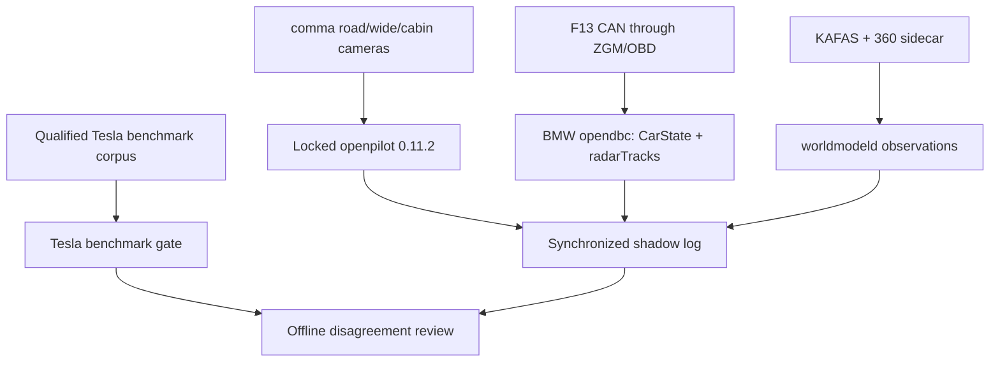

# BMW F13 Autonomy

Experimental BMW F13 integration built around a reproducible upstream openpilot release, BMW CAN/FlexRay observation and Tesla HW4/FSD as a behavioural verification benchmark.

> **The goal is not to put Tesla FSD into a BMW.** The goal is to use Tesla HW4/FSD as an evolving behavioural teacher and benchmark while developing an independent openpilot-based autonomy stack for the BMW F13.

## Project status

**Pre-vehicle BMW integration / Beta 1 shadow preparation.** The current published upstream openpilot release is **v0.11.1**. Prototype 001 pins the reviewed official `zeroeleventwo` development-branch commit `044640668aa25d5c72f948ec072bfc259d1b269a` for reproducible shadow work; it is not described as a published v0.11.2 tag unless upstream publishes that tag.

The repository now contains transport-aware CAN/FlexRay passive discovery, cross-session evidence, FRR track hypotheses, CAN↔FlexRay correspondence, request/feedback topology analysis, a shadow-only BMW control-intent architecture, and explicit Beta 1 hardware/software policies.

The first real-car objective is **F13 Observation Run 001 in December 2026**. Supervised motorway/highway autonomy remains a later target after replay, HIL and closed-course validation.

See `docs/PROJECT_STATUS_2026-09-06.md` for the current implementation state.

## Executable baseline

The upstream base is locked in `upstream/openpilot.lock.json` rather than following a moving branch. The current shadow baseline is the official `zeroeleventwo` branch commit `044640668aa25d5c72f948ec072bfc259d1b269a`, including its exact `opendbc` and Panda submodule commits.

```bash
python tools/openpilot_workspace.py validate
python tools/openpilot_workspace.py prepare .openpilot-workspace/openpilot-0.11.2 --with-submodules
```

See `docs/OPENPILOT_BASELINE.md` for the BMW integration boundary and upgrade procedure.

## Background

We are **BMW F13/F-series enthusiasts and practical integrators, not professional autonomous-driving software engineers**. Our strongest experience is hands-on BMW F13/F-series work, automotive electrical/electronic systems, mechanical integration, diagnostics and basic programming. We are comfortable understanding systems, wiring, signals, hardware constraints and integration problems, but we do not claim deep expertise in advanced software engineering, machine learning, embedded safety or openpilot internals.

A substantial part of this repository has been developed with AI assistance. AI is used for research, code generation, explanation, documentation, tests, simulation scaffolding, log analysis and CAN/FlexRay tooling. We contribute the project direction, practical vehicle knowledge, integration requirements, test ideas and engineering judgment, while relying on AI and external technical review for areas beyond our software expertise.

We do **not** want AI-generated code to be mistaken for independently expert-authored safety-critical software. We may understand the intended behavior and architecture without being able to manually implement or fully audit every low-level detail ourselves. For that reason, anything safety-critical must remain reviewable, tested and staged through simulation, replay, HIL and controlled validation before physical actuation is considered.

We actively want experienced openpilot/comma, embedded, BMW CAN/FlexRay and safety developers to challenge assumptions, review code and help reshape anything that does not meet upstream engineering standards.

## Core idea

```text
locked upstream openpilot 0.11.2
+ comma four / Panda for the first Beta
+ BMW OEM sensors
+ ACC-SEN front radar + SWW blind-spot radar
+ KAFAS and synchronized 360-degree sidecar perception
+ Tesla HW4/FSD behavioural benchmark
+ BMW CAN/FlexRay integration
```

The BMW should ultimately operate **without Tesla HW4**. HW4 is intended as a teacher, behavioural benchmark, disagreement source and validation reference — not the final required controller and never a direct BMW actuator controller.

## High-level architecture



This is the current shadow architecture. The later BMW control bridge remains outside the executable Beta until separate replay, HIL, safety-controller and closed-course gates are passed.

## Operating modes

### OEM / Manual

The BMW must remain normally driveable if the autonomy computer is unavailable. The retrofit should fail toward normal OEM/manual operation wherever technically possible.

### Partial Autopilot

Default assisted-driving mode without requiring a navigation route. Initial targets include lane centering, adaptive cruise, following-distance management, curve adaptation, cut-in handling, collision awareness, blind-spot perception, driver monitoring and driver-confirmed lane changes.

### Highway Supervised Autonomy

When a valid route is active and the road is inside the supported ODD, the system may offer highway autonomy. Targets include route-based lane selection, overtaking, automatic lane changes, motorway merging, exits and route preparation. It remains supervised.

## Action Questions and uncertainty

The system should ask the driver only when human intent is genuinely useful, such as choosing between valid routes or semantic preferences. It should **not** outsource safety decisions such as whether a lane change is physically safe.

Perception or prediction uncertainty should produce conservative behaviour: wait, increase margin, avoid the manoeuvre, or request takeover when required.

## Tesla HW4/FSD as teacher

We want to compare the same scenario across:

```text
Tesla FSD
vs openpilot
vs our policy
vs human driver
```

The objective is not blind imitation. Tesla is a benchmark, not an absolute authority. Disagreements become high-value validation/training cases.

### teslaoracled

A proposed read-only bridge, `teslaoracled`, would normalize externally observable HW4/FSD behaviour into states such as autopilot state, desired speed, longitudinal/steering request where observable, lane-change state/direction, blind-spot state, FCW, speed-limit/navigation state and timestamps.

The project does **not** aim to extract or redistribute Tesla proprietary FSD software or model weights.

### HW4 bench research questions

We want to determine the minimum viable genuine HW4 bench environment, which Tesla ECUs/states must remain, which signals can legitimately be replayed/emulated, calibration requirements, update behaviour and which DAS/FSD outputs can be externally observed.

Preferred concept:

```text
GENUINE TESLA HW4
       |
GENUINE FSD SOFTWARE
       |
READ-ONLY OBSERVATION
       |
teslaoracled
```

HW4 has no direct authority over BMW steering or braking.

## Openpilot runtime strategy

The first physical Beta uses a comma device and Panda because that gives the project a known openpilot camera, driver-monitoring, logging and vehicle-interface base. Custom compute remains an optional later optimization for multi-camera perception, occupancy, BEV and larger-model experiments.

We preserve upstream interfaces and keep BMW additions in the `opendbc` vehicle boundary wherever practical. Extra 360-degree cameras are initially recorded and processed by a synchronized sidecar; they are not presented to the upstream driving model as fictitious road/wide streams.

```text
custom cameras
     |
our_camerad
     |
VisionIPC
     |
modeld
```

## Camera/perception concept

Potential synchronized camera coverage includes front tele/main/wide, front-left/right, side-left/right and rear views. Exact count is not final; useful coverage, HDR, synchronization, low latency and image quality matter more than camera count.

Prototype capture may use development interfaces; the final target is automotive high-speed camera transport such as GMSL-class links into the compute system.

The perception stack may eventually include object/lane/free-space detection, depth/motion estimation, tracking, radar-camera fusion, BEV, occupancy, trajectory prediction, road topology and unknown-obstacle handling.

## World model

All sources should be transformed into a consistent BMW ego coordinate system. Inputs may include custom cameras, BMW radar, KAFAS, PDC/Parking High, GPS, IMU, wheel speeds, steering/yaw/dynamics state and the read-only Tesla benchmark.

We intentionally do not follow a vision-only ideology: useful BMW radar tracks should be fused with vision.

## BMW CAN/FlexRay integration

FlexRay is a major research area. We want to understand and preserve BMW F-series OEM control loops involving ICM, DSC and EPS rather than bypassing them with crude external actuators.

```text
openpilot
    |
VehicleCommand
    |
bmwcontrold
    |
Safety MCU
    |
CAN / FlexRay
    |
ICM / DSC / EPS
```

The planner should produce abstract commands such as target speed, acceleration and curvature. BMW-specific translation belongs below that abstraction. The GPU/neural model should never directly drive an EPS motor or brake actuator.

## Independent safety controller

A dedicated MCU layer should sit between Linux/GPU compute and the BMW. Responsibilities may include CAN/CAN-FD/FlexRay interfacing, watchdogs, command limits, plausibility checks, driver override, communication-loss handling and hardware autonomy disable.

Driver brake/steering override remains authoritative. EPS/DSC/communication faults must degrade or disable automation safely.

## Meta-planner

The final planner should not blindly majority-vote between models. Inputs can include openpilot, our policy, Tesla benchmark, navigation and the world-model safety layer. Physics and safety constraints must be able to veto learned behaviour.

## Disagreement mining and human review

One central idea is automatically saving cases where Tesla, openpilot, our policy and/or the human disagree. These are more informative than long stretches of easy driving where every system agrees.

A simple graphical review tool should show video/world state and each proposed action, allowing a human to label which behaviour was preferable, unsafe or uncertain without needing to edit training code.

## Black-box logger

Maintain a rolling synchronized buffer of cameras, radar, CAN, FlexRay, GPS/IMU, world model, openpilot output, Tesla benchmark, planner output, BMW state, driver inputs and confidence. Preserve event windows around takeovers, hard braking, FCW, disagreements, cut-ins, faults and unexpected interventions.

## GPS/navigation behaviour

GPS position alone does not enable route autonomy. Partial Autopilot should remain available without navigation. Highway mode requires a valid route, supported road/ODD, healthy sensors, sufficient confidence and explicit driver activation.

## Modular software strategy

Because this is a small AI-assisted project rather than a large professional autonomy team, modularity is essential. Proposed services include:

```text
our_camerad
teslaoracled
bmwstated
worldmodeld
metaplannerd
bmwcontrold
```

The aim is to keep upstream openpilot changes as small and reviewable as possible.

## Planned repository structure

```text
f13-autonomy/
├── README.md
├── upstream/
│   └── openpilot.lock.json
├── integration/
│   └── openpilot/
├── docs/
│   ├── ARCHITECTURE.md
│   ├── HARDWARE.md
│   ├── BMW_FLEXRAY.md
│   ├── TESLA_HW4.md
│   ├── CAMERA_SYSTEM.md
│   ├── SAFETY.md
│   └── ROADMAP.md
├── services/
│   ├── teslaoracled/
│   ├── bmwstated/
│   ├── worldmodeld/
│   ├── metaplannerd/
│   └── bmwcontrold/
├── interfaces/
├── hardware/
│   ├── camera_board/
│   ├── safety_board/
│   └── flexray/
├── simulation/
│   ├── fake_tesla/
│   ├── fake_bmw/
│   └── scenarios/
├── tools/
│   ├── openpilot_workspace.py
│   ├── log_viewer/
│   ├── disagreement_viewer/
│   └── dataset_builder/
└── tests/
```

## Development milestones

**M0 — Shadow Lab:** cameras + BMW CAN/FlexRay logging, openpilot execution, fake Tesla oracle, decision visualization and disagreement storage. No actuation.

**M1 — Sensor Shadow Beta:** locked openpilot build + comma cameras + passive BMW CAN/ACC/SWW/KAFAS observation. Tesla datasets remain an independent verification track rather than a Beta runtime dependency.

**M2 — BMW Shadow:** `bmwcontrold` calculates but does not transmit commands; compare proposed steering/acceleration with human action.

**M3 — HIL:** BMW donor ECUs on a bench with the safety/control stack.

**M4 — Closed Course:** first controlled physical actuation.

**M5 — Partial Autopilot:** lane centering, ACC, cut-in/collision handling and supervised lane changes.

**M6 — Highway Supervised:** route-aware highway lane management, overtaking, merging and exits within a validated ODD.

## AI-assisted development workflow

```text
AI-assisted proposal
        |
code/human review
        |
simulation + unit tests
        |
recorded-data replay
        |
hardware-in-the-loop
        |
controlled validation
```

Not: generated code directly to public-road safety-critical testing.

## Collaboration wanted

We especially want to hear from people experienced with:

- Tesla HW4 bench setups, DAS/FSD CAN, gateway/networking, calibration and observable outputs
- openpilot custom hardware, VisionIPC, modeld, cereal, Panda/safety and external GPU inference
- BMW F-series CAN/FlexRay, ICM, DSC, EPS, ACC radar, KAFAS and steering retrofits
- multi-camera BEV/occupancy, tracking, prediction, imitation/teacher-student learning and uncertainty estimation

### Questions for HW4 developers

1. What is the minimum HW4 bench configuration required to keep useful DAS/FSD functions operating?
2. Which genuine ECUs need to remain present?
3. Which vehicle states can be replayed/emulated for legitimate research?
4. Can an entitled HW4 remain useful outside its donor vehicle?
5. Which FSD outputs are externally observable?
6. Can steering/longitudinal/lane-change intent be decoded reliably?
7. Can recorded state traffic reproduce useful development conditions?
8. What changes across OTA versions?
9. Can a stable abstraction layer be built above observable Tesla messages?
10. Has anyone already built a complete HW4 bench with active perception/planning?

## What this project is not

This project is not intended to redistribute Tesla proprietary software/model weights, bypass safety systems, directly connect neural-network output to actuators, remove driver responsibility during development, or test unvalidated safety-critical code on public roads.

## Long-term objective

```text
Tesla FSD quality benchmark
           |
continuous comparison
           |
disagreement dataset
           |
training + validation
           |
independent openpilot-based BMW stack
```

As the benchmark improves, our validation target moves forward too.

## Final vision

A BMW F13 retaining OEM/manual driving while gaining a modular path toward Partial Autopilot and supervised highway autonomy, with 360-degree perception, radar fusion, openpilot big models, Tesla HW4 as a read-only behavioural benchmark, BMW CAN/FlexRay integration, OEM-style EPS/DSC control and an independent safety MCU.

## Current priorities

- prepare December F13 Observation Run 001
- validate BMW CAN/ZGW/OBD visibility before assuming FlexRay is required
- add passive FlexRay RX only for missing/ambiguous functions
- validate core BMW ego-state signals for a read-only `CarState`
- validate FRR/SWW evidence for later `RadarData` / blind-spot adapters
- characterize steering and longitudinal request↔feedback topology without TX
- keep Comma Four as the Beta 1 openpilot/front-perception baseline
- engage the openpilot/comma community with small, reviewable technical contributions
- defer KAFAS2, surround/LiDAR, eGPU and actuation hardware until measured blockers justify them

## Contributions

Technical criticism and collaboration are welcome. In particular, if you have worked with **Tesla HW4 bench testing, FSD/DAS CAN, openpilot hardware ports or BMW FlexRay**, we would like to hear from you.

This project is intentionally ambitious. The approach is to break that ambition into small, testable and independently verifiable engineering problems.
