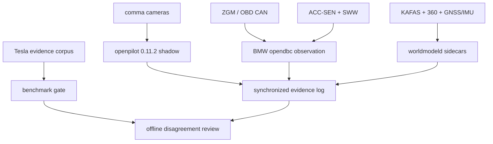

# System Architecture

## Goal

Integrate the BMW F13 around a reproducible upstream openpilot build, with Tesla HW4/FSD used only as a read-only behavioural verification benchmark.

The first executable system is openpilot `0.11.2` on comma/Panda hardware in shadow/no-output mode. The exact upstream and submodule commits are recorded in `upstream/openpilot.lock.json`.

## Core domains

1. **Perception domain** — synchronized cameras, BMW radar/KAFAS/PDC, GNSS/IMU, occupancy and tracking.
2. **Driving domain** — openpilot driving model, custom world model, route-aware behaviour and meta-planning.
3. **Benchmark domain** — Tesla HW4/FSD observer (`teslaoracled`) for behavioural comparison.
4. **Vehicle domain** — BMW state extraction and command abstraction over CAN/FlexRay.
5. **Safety domain** — independent MCU watchdog, plausibility checks, driver override and fail-safe behaviour.

## M0/M1 data flow



No component in this M0/M1 graph transmits a BMW vehicle command.

## Software boundaries

- upstream camera/model path: comma road/wide/cabin streams for the first Beta.
- `our_camerad`: later custom synchronized camera experiments behind VisionIPC-compatible interfaces.
- BMW `opendbc` package: standard `CarState` plus front ACC `RadarInterface`, initially read-only and `dashcamOnly`.
- `bmwstated`: richer BMW state from CAN/FlexRay/OEM sensors outside the minimum openpilot interface.
- `worldmodeld`: fused ego-centric representation.
- `teslaoracled`: read-only Tesla HW4/FSD benchmark state admitted only through the benchmark provenance gate.
- `metaplannerd`: combines openpilot, world-model safety, route intent and benchmark comparison.
- `bmwcontrold`: converts abstract vehicle commands into BMW-specific requests.

## Later VehicleCommand abstraction

```text
VehicleCommand {
  target_speed
  target_acceleration
  target_curvature
  curvature_rate
  lane_change_intent
}
```

The autonomy stack should not expose direct low-level motor/brake commands above `bmwcontrold`. This interface is a later design contract and is not enabled by the shadow build.

## Operating modes

### OEM / Manual

Normal BMW operation remains available if autonomy compute is unavailable.

### Partial Autopilot

No active navigation route required. Lane centering, ACC, following-distance control, cut-in/collision handling, blind-spot awareness and driver-confirmed lane changes.

### Highway Supervised Autonomy

Only when a valid route and supported ODD are available, and only after explicit driver activation. Route-aware lane management, overtaking, merge handling and exits are the initial target.

## Design rule

Tesla HW4/FSD is a benchmark input, never a direct actuator authority. Physics and deterministic safety constraints must be able to veto any learned-model proposal.
